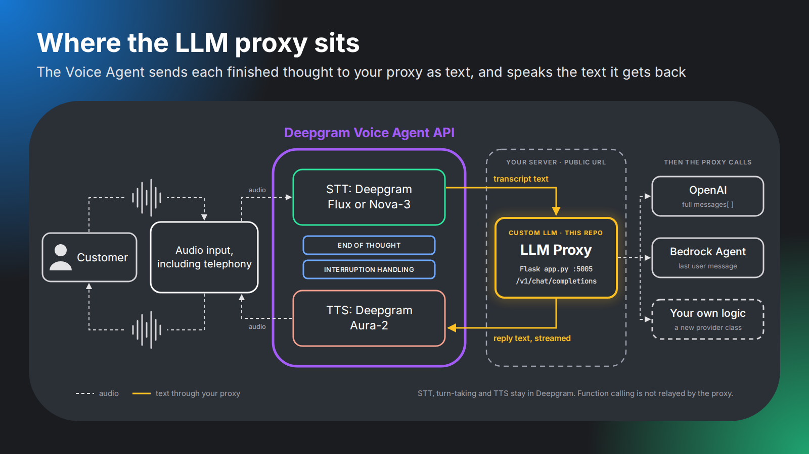
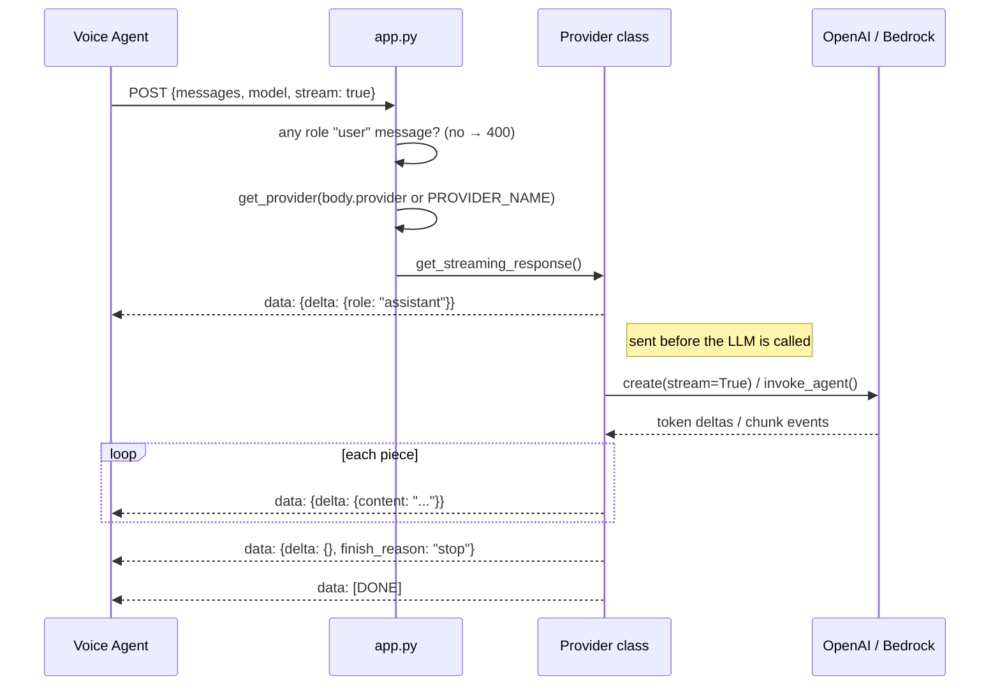

# Multi-Provider Chat Completions Proxy

This component provides an OpenAI-compatible chat completions API that can use multiple LLM providers, including Amazon Bedrock Agents and OpenAI. It's designed to be modular and extensible, allowing you to easily switch between providers or add new ones.

*Note: In order for non-local models to work, you will need to have this proxy server accessible over the internet. You can use tools like ngrok to expose your local server to the internet.*

## Features

- OpenAI-compatible `/v1/chat/completions` endpoint
- Support for multiple LLM providers (Bedrock, OpenAI, and extensible for more)
- Easy provider switching through environment variables or request parameters
- Support for both streaming and non-streaming responses
- Message logging for requests and responses
- Exact matching of OpenAI's response format
- Comprehensive error handling and logging

The proxy will forward the text to your proxy's configured LLM. Specifically, you will point your Voice Agent config's `think` endpoint to your proxy's URL:
```
"think": {
  "endpoint": {
    "url": "https://your-proxy-endpoint.com/v1/chat/completions",
    }
  }
```

## How it works

The Voice Agent's `think` step normally calls an LLM provider directly. With this proxy, the agent calls your server instead. Your server speaks the OpenAI chat-completions protocol, forwards the turn to OpenAI or an Amazon Bedrock Agent, and re-wraps the answer as OpenAI-style streaming chunks. Listening (speech-to-text) and speaking (text-to-speech) stay inside Deepgram.

Deepgram's servers make the `think` call, not the end user's browser, so the proxy needs a public URL (ngrok locally, or a load balancer in AWS).



Audio never reaches the proxy. Deepgram turns the caller's speech into text, decides when they've finished a thought, and sends that transcript to the proxy (the yellow path). The proxy can forward the text to an LLM or act on it itself; whatever text it returns is what the agent speaks.

The Voice Agent posts each turn to `POST /v1/chat/completions` on the proxy (Flask `app.py`, port 5005), which picks a provider from `body.provider` or `PROVIDER_NAME`. OpenAI gets the full `messages[]` through `chat.completions.create`. A Bedrock Agent gets only the last user message through `invoke_agent`. Your own logic goes in a new provider class (see [Adding New Providers](#adding-new-providers)). The proxy streams the reply back as OpenAI-style SSE chunks.

Speech-to-text, end-of-thought detection, interruption handling and text-to-speech stay inside Deepgram and work unchanged. Function calling is not relayed through the proxy; see [Known limitations](#known-limitations).

The diagram source is `docs/assets/src/voice-agent-api.html`. To regenerate the PNG, screenshot it in a 1600×900 viewport.

### One conversational turn



Flask passes the provider's generator straight through (`stream_with_context`, `X-Accel-Buffering: no`), so each chunk goes out as soon as it's produced and TTS can start on the first content chunk. If the upstream returns nothing, the provider sends a canned "I apologize, but I received no response..." message, and the agent speaks it.

### The two providers

| | OpenAI | Bedrock Agent |
|---|---|---|
| Needs | `OPENAI_API_KEY`, optional `OPENAI_MODEL` | `AGENT_ID`, `AGENT_ALIAS_ID`, AWS keys, `AWS_REGION` |
| Sends upstream | The whole `messages[]`, including the system prompt and history | Only the last user message, as `inputText` |
| Memory across turns | Yes: the Voice Agent resends history on every turn | No: every request gets a new random `sessionId` |
| Streaming | Real token deltas, re-wrapped one for one | `chunk` events only; a Bedrock Agent typically returns its answer in one piece |

### Known limitations

- **Function calling doesn't pass through.** The proxy doesn't forward `tools` from the request or `tool_calls` from the response. Only text content is relayed.
- **No authentication.** Anyone with the public URL can use your provider credentials. Add a check on a header you configure in the Voice Agent `think.endpoint.headers` before you expose it.
- **Bedrock has no conversation memory.** Only the last user message is sent, with a new session each time, so follow-up questions lose their context and the Voice Agent's system prompt never reaches the agent.
- **Transcripts are logged at INFO.** Request bodies and replies are logged in full (`app.py`, `providers/base.py`), so a caller's words end up in the logs.
- **Errors mid-stream arrive as data.** Once streaming starts the HTTP status is already 200, so an upstream failure is sent as a `data: {"error": ...}` event without `[DONE]`.

## Server Components

### Main Application (`app.py`)
- Flask server implementation
- Request/response handling
- Provider selection and management
- Format conversion
- Error handling

### Provider System (`providers/`)
- Base provider interface (`base.py`)
- Bedrock provider implementation (`bedrock.py`)
- OpenAI provider implementation (`openai.py`)
- Provider factory for easy selection (`__init__.py`)

### Streaming Support
The server implements Server-Sent Events (SSE) streaming that:
- Matches OpenAI's chunk format exactly
- Relays OpenAI token deltas as they arrive; Bedrock Agent output is forwarded per completion chunk
- Handles role and content deltas
- Forwards Bedrock completion chunks (the non-streaming path also reads trace final responses)
- Maintains consistent message IDs

## Setup

1. Install dependencies:
```bash
pip install -r requirements.txt
```

2. Configure environment:
```bash
cp .env.example .env
```

Required variables in `.env` (depending on which providers you want to use):
```
# Provider Selection
# Options: "bedrock", "openai", or leave empty for openai
PROVIDER_NAME=openai

# OpenAI Configuration (required if using OpenAI provider)
OPENAI_API_KEY=your_openai_api_key
OPENAI_MODEL=gpt-4o-mini

# Bedrock Configuration (required if using Bedrock provider)
AGENT_ID=your_bedrock_agent_id
AGENT_ALIAS_ID=your_bedrock_agent_alias_id
AWS_ACCESS_KEY_ID=your_aws_access_key_id
AWS_SECRET_ACCESS_KEY=your_aws_secret_access_key
AWS_REGION=us-east-1

# Logging Configuration (optional)
LOG_LEVEL=INFO
```

3. Start the server:
```bash
python app.py
```

## Running Locally with ngrok

To make your local server accessible over the internet (useful for testing with external tools):

1. Install ngrok:
```bash
# On Ubuntu/Debian
curl -s https://ngrok-agent.s3.amazonaws.com/ngrok.asc | sudo tee /etc/apt/trusted.gpg.d/ngrok.asc >/dev/null && echo "deb https://ngrok-agent.s3.amazonaws.com buster main" | sudo tee /etc/apt/sources.list.d/ngrok.list && sudo apt update && sudo apt install ngrok

# On macOS with Homebrew
brew install ngrok

# Or download from https://ngrok.com/downloads
```

2. Sign up at https://ngrok.com and get your authtoken

3. Configure ngrok:
```bash
ngrok config add-authtoken your_auth_token
```

4. Start the Flask server:
```bash
python app.py
```

5. In a new terminal, start ngrok:
```bash
ngrok http 5005
```

6. Use the provided URL:
- ngrok will display a URL like `https://xxxx-xx-xx-xxx-xx.ngrok-free.app`
- Your OpenAI-compatible endpoint will be available at `https://xxxx-xx-xx-xxx-xx.ngrok-free.app/v1/chat/completions`
- You can use this URL in any OpenAI-compatible client by setting the base URL

In this example, you will update your Voice Agent `think` settings like:
```
"think": {
  "endpoint": {
    "url": "https://xxxx-xx-xx-xxx-xx.ngrok-free.app/v1/chat/completions",
    }
  }
```

# Example using OpenAI Python client:
```python
from openai import OpenAI

client = OpenAI(
    base_url="https://xxxx-xx-xx-xxx-xx.ngrok-free.app/v1",
    api_key="not-needed"  # The proxy doesn't check API keys
)

# Using the default provider configured in .env
response = client.chat.completions.create(
    model="gpt-4o-mini",  # Will use the provider's default model
    messages=[
        {"role": "user", "content": "Hello, how can you help me?"}
    ],
    stream=True  # Supports both streaming and non-streaming
)

# Or specify a provider explicitly in the request
response = client.chat.completions.create(
    model="gpt-4o-mini",
    messages=[
        {"role": "user", "content": "Hello, how can you help me?"}
    ],
    stream=True,
    provider="openai"  # Force using the OpenAI provider
)

for chunk in response:
    print(chunk.choices[0].delta.content or "", end="")
```

Note: The ngrok free tier provides:
- Random URLs that change each time you start ngrok
- Rate limits that should be fine for testing
- For production use, consider ngrok's paid tiers or proper deployment

## API Reference

### Chat Completions

`POST /v1/chat/completions`

#### Request Format
```json
{
    "model": "gpt-4o-mini",
    "messages": [
        {"role": "system", "content": "You are a helpful assistant."},
        {"role": "user", "content": "Hello, how can you help me?"}
    ],
    "stream": false,
    "provider": "openai"  // Optional: explicitly select a provider
}
```

#### Response Format (Non-Streaming)
```json
{
    "id": "chatcmpl-123abc...",
    "object": "chat.completion",
    "created": 1677858242,
    "model": "bedrock-agent",
    "choices": [
        {
            "index": 0,
            "message": {
                "role": "assistant",
                "content": "The response from the agent..."
            },
            "finish_reason": "stop"
        }
    ],
    "usage": {
        "prompt_tokens": -1,
        "completion_tokens": -1,
        "total_tokens": -1
    }
}
```

#### Streaming Response Format
When `stream: true`, responses are sent as Server-Sent Events:
```json
data: {"id":"chatcmpl-123","object":"chat.completion.chunk","created":1234567890,"model":"bedrock-agent","choices":[{"index":0,"delta":{"role":"assistant"},"finish_reason":null}]}

data: {"id":"chatcmpl-123","object":"chat.completion.chunk","created":1234567890,"model":"bedrock-agent","choices":[{"index":0,"delta":{"content":"Hello"},"finish_reason":null}]}

data: {"id":"chatcmpl-123","object":"chat.completion.chunk","created":1234567890,"model":"bedrock-agent","choices":[{"index":0,"delta":{},"finish_reason":"stop"}]}

data: [DONE]
```

## Provider API

### List Available Providers

`GET /v1/providers`

Returns information about available providers and their status:

```json
{
    "providers": [
        {
            "name": "bedrock",
            "available": true,
            "default_model": "bedrock-agent"
        },
        {
            "name": "openai",
            "available": true,
            "default_model": "gpt-4o-mini"
        }
    ],
    "default": "openai"
}
```

## Adding New Providers

To add a new provider:

1. Create a new file in the `providers/` directory (e.g., `anthropic.py`)
2. Implement the `CompletionProvider` interface
3. Add the provider to the factory in `providers/__init__.py`
4. Update the environment variables as needed

## Implementation Notes

- Token usage is not reported: non-streaming responses return -1 for every provider
- A new Bedrock session ID (UUID4) is generated for every request, so a Bedrock Agent keeps no memory between turns
- Streaming errors use OpenAI's error object shape; non-streaming errors return `{"error": "<message>"}`
- Error messages are returned to the caller unmodified, so upstream error details are visible to whoever calls the proxy
- AWS credentials are read from plain environment variables (`.env` via python-dotenv); use a secrets manager or an IAM role in production 
